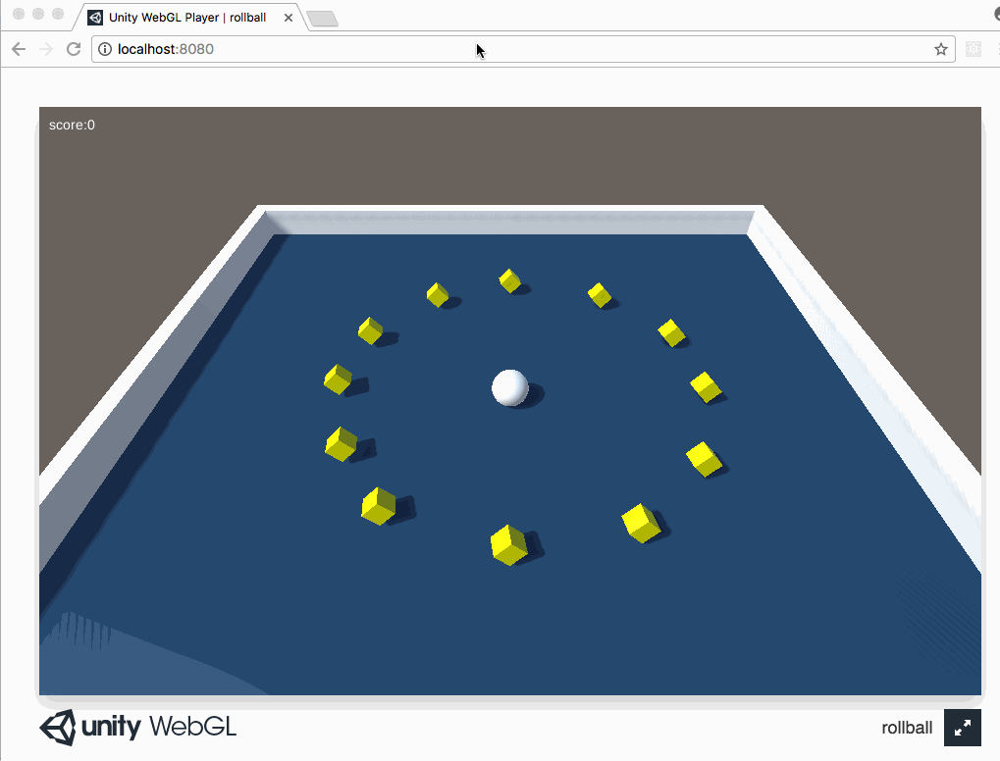

# roll a ball tutorial demo

## 运行效果

## 开发总结

1. 新建一个game object，此时这个物体只有transform属性，没有其他属性，在场景里看不到
1. 新建的3d物体，比如sphere，cube是静态的，但是它们默认具有碰撞体属性
1. 一般情况下，物理引擎不允许两个碰撞体重叠，当物理引擎检测到发生碰撞时，动态的碰撞体会被弹开，不会发生重叠或者穿透，静态的碰撞体依旧保持不动
1. 当我们给碰撞体添加了触发器之后，碰撞体就可以重叠或者穿透了，通过OnTriggerEnter检测碰撞
1. Unity会计算场景中所有静态碰撞体的值并且保存在缓存中，如果静态碰撞体发生动画变形运动，那么Unity每一帧都会计算该静态碰撞体的值并且缓存在缓存中，这会占用大量的资源，解决办法是给小方块添加刚体属性，一个物体具有碰撞体和刚体属性就会被认为是一个动态的碰撞体，这样就不会每一帧都会缓存碰撞值（小方块cube天生就具有碰撞体的组件，所以只需要添加刚体组件就行）
1. 给小方块添加刚体组件之后，小方块不能被地板接住，会直接掉下去，解决办法是在刚体组件里选择Kinematic刚体属性，Kinematic刚体不受物理作用力的影响，但是可以动画运动
1. 为什么小方块添加刚体组件不能被地板托举住而小球可以被地板托举住不往下掉？因为小方块在碰撞体里面勾选了触发器选项，带触发器的碰撞体可以在碰撞的时候穿透和重叠，所以就需要小方块在刚体里面勾选Kinematic刚体属性，这样就不受外力的影响了
1. LateUpdate在Update执行完之后调用，比如游戏中的物体发生了移动，我们需要移动摄像机，移动摄像机的方法我们通常写在LateUpdate中
1. FixedUpdate，固定的时间间隔来被调用,看起来运动更平滑，当处理刚体的时候，我们使用FixedUpdate替代Update
1. Time.deltaTime，完成最后一帧所需的时间（以秒为单位）（只读），使用此功能使您的游戏帧速率独立，如果对每个帧的值加或减一个值，你应该乘以Time.deltaTime。当乘以Time.deltaTime时，你基本上表达：我想移动这个对象10米每秒而不是10米每帧。
